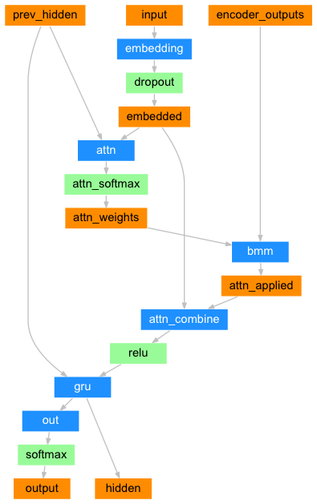

# Neural-Machine-Translation

In this project used a neural network to translate from French to English.by the simple but powerful idea of the sequence to sequence network, in which two recurrent neural networks work together to transform one sequence to another. An encoder network condenses an input sequence into a vector, and a decoder network unfolds that vector into a new sequence.To improve upon this model we’ll use an attention mechanism, which lets the decoder learn to focus over a specific range of the input sequence.

### Encoder Decoder Architecture
#### Encoder Network

#### Decoder Network with attention

## Output

[KEY: > input, = target, < output]

> il est en train de peindre un tableau .  
= he is painting a picture .  
< he is painting a picture .  

> pourquoi ne pas essayer ce vin delicieux ?  
= why not try that delicious wine ?  
< why not try that delicious wine ?  

> elle n est pas poete mais romanciere .  
= she is not a poet but a novelist .  
< she not not a poet but a novelist .  

> vous etes trop maigre .  
= you re too skinny .  
< you re all alone .  

### Resources used

https://pytorch.org/tutorials/intermediate/seq2seq_translation_tutorial.html

